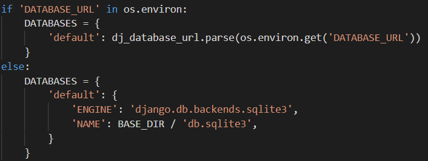
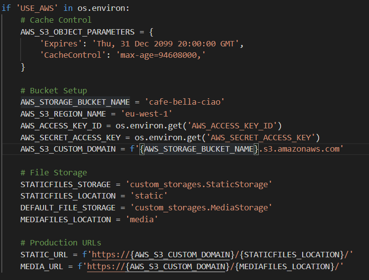

## Cloning the GitHub repository

Assuming you already have Git [installed](https://git-scm.com/download/), anybody can clone this repository by following these steps:

1. Open the command prompt/terminal on your machine;
2. Type the command 'cd' followed by the directory you wish to store the repository in;
3. Go to the top of the [GitHub repository](https://github.com/kiehozero/bella-ciao/) and click the green 'Code' drop-down button;
4. Copy the [link provided](https://github.com/kiehozero/bella-ciao.git);
5. Return to the Command Prompt and type 'git clone' followed by the copied address.

For an in-depth guide to cloning repositories, click [here](https://www.howtogeek.com/451360/how-to-clone-a-github-repository/), from which the steps above were taken.

## Heroku

I deployed this project to Heroku using the following method:

1. After setting up a [Heroku](https://www.heroku.com/) account and creating a new app, head back to your terminal and set up a requirements.txt file that automatically updates when you import a library. 

2. You will need to configure a Postgres add-on within Heroku; these are available in the Resources tab for free at a hobby level and take a matter of seconds to start. 

3. Install dj_database_url and psycopg2 with the pip3 install command in the CLI, then import the former to your settings.py file.

4. Take the DATABASE_URL key from Heroku's config vars and set the database entries as below (comment out the SQLite entry for the time being, this is the default Django database within Gitpod)

5. Temporarily save the DATABASE_URL_KEY in quotations inside in parse brackets, but do not commit as this needs to be kept secret. Run python3 manage.py migrate to push your existing database to this one, then login in to heroku via the CLI to create a superuser. At this point, remove the comments from around the original DB and replace the Heroku database address with the text above.

6. Install gunicorn using pip, which will act as a worker dyno in Heroku, and freeze to requirements.txt again. Create a file called Procfile (no extensions needed) and add a single line of text to it: web: gunicorn APP_NAME.wsgi:application. It will be obvious if you have created the file correctly as its icon will be the Heroku logo.

7. In the CLI, run the command heroku config:set DISABLE_COLLECTSTATIC=1 so it ignores any static files once it is connected to your Github account, and all the address of you Heroku app to ALLOWED_HOSTS in settings.py. Also add 'localhost' to this so you can run a test environment out of Gitpod.
8. Push your changes using the usual Gitpod method, then using 'git push heroku master' to make an initial push to Heroku.
9. In the Heroku app settings, click the Connect to GitHub button and select the repository you wish for Heroku to connect to. 
10. Once the connection is confirmed, scroll down to the bottom and click the Enable Automatic Deployment button.
11. After a couple of minutes select the Open App button, and you will now have a hosted URL for the project. Unlike Gitpod or any other IDE, this app will only update when you push changes to your repository.
12. Create a secret key using [this](https://miniwebtool.com/django-secret-key-generator/) page, add it to your config vars in Heroku and use the os.environ.get method used above to make a secure call to Heroku for this from Gitpod.
 

## Amazon Web Services

Two AWS utilities feature in this project, Simple Secure Storage (or S3) and Identity and Access Management (IAM). Both can be set up pretty quickly once you have an Amazon account.

Navigate to the [S3](https://aws.amazon.com/) website and create a new bucket to store the media and static files for the project. AWS changes layout quite often so when you see the prompt to allow all public access, approve this. Turn on static hosting under Properties, and paste in the CORS config under the Permissions heading:

[
	{
 		"AllowedHeaders": [
     		"Authorization"
 		    ],
 	    "AllowedMethods": [
		    "GET"
 		    ],
 		"AllowedOrigins": [
     	    "*"
 		    ],
		"ExposeHeaders": []
	}
] 

Then go to the policy generator to authorise read and write access for this bucket. The policy can be located in a dropdown and is simply called S3 bucket policy, and add '/*' so all sub-items can be accessed using it. Copy the ARN number from the bucket policy tab and add it in, then click generate statement and copy to the bucket policy editing area, then add the star symbol after a forward slash again to cover all items within it. Finally, in Access Control, tick Everyone next to the List Objects under the Public Access heading.

At this point navigate back to the Amazon's enormous services menu and search for IAM or Identity and Access Management, where you can link administrative accounts and groups to maintain the bucket itself. This is obviously a scalable solution but you only need to make one user inside one group for this project. Navigate to the Create Group button then create Policy. 

Under the JSON tab click Import Managed Policy and add S3 Full Access, and add in the ARN mentioned above into the JSON box. Click review to give the policy a name and click create.

Head back to Group area and click Manage My Group, Attach Policy and then add the name of the policy created above. All that is needed now is a user to populate the group and use the policy, so click the User tab and Add User. Create a new user and give them programmatic access. Download the CSV file generated and store is somewhere as these keys cannot be regenerated.

Heading back to the CLI, install boto3 and dhango-storages using pip, then freeze these to your requirements.txt file in the root directory, as well as adding storages to your installed apps list.

## Python Libraries

This project is built on the [Django](https://www.djangoproject.com/) framework. A number of libraries were installed to complete this project, and can be installed simply by using the pip3 install command in the command line interface. All libraries except pylint-django are operational requirements for this project, although alternative storage and hosting methods are available.

- [django-allauth](https://pypi.org/project/django-allauth/) is an authentication and account management library;
- [dj_database_url](https://pypi.org/project/dj-database-url/) - quick access to configure a database to your local environment;
- [gunicorn](https://pypi.org/project/gunicorn/) - a HTTP server dyno to power Heroku apps;
- [stripe](https://pypi.org/project/stripe/) - Stripe's official API. Their official website is also packed with tutorials on everything you can do with their API;
- [django-crispy-forms](https://github.com/django-crispy-forms/django-crispy-forms) - take the hassle out of form alignment and design with crispy-forms;
- [boto3](https://pypi.org/project/boto3/) - A Python software development kit for Amazon Web Services;
- [django-storages](https://pypi.org/project/django-storages/) - To quote the PyPI directory, "a project to provide a variety of storage backends in a single library";
- [pylint-django](https://pypi.org/project/pylint-django/) - A linter specifically designed for use with Django.

# GMail SMTP

Google Mail actually has a relatively simple process to set up e-mail services from Heroku. Navigate to the Security section of a Google account and enable two-factor authentication. From here you can generate a unique 16-character code to be added to Heroku's config vars as EMAIL_HOST_PASSWORD. Also needed will be EMAIL_HOST_USER and DEFAULT_FROM_EMAIL (both the GMail address being used). Use the os.environ.get method to call these securely from Heroku, then state the following items in settings.py:

 - EMAIL_BACKEND = 'django.core.mail.backends.smtp.EmailBackend'
 - EMAIL_USE_TLS = True
 - EMAIL_PORT = 587
 - EMAIL_HOST = 'smtp.gmail.com'